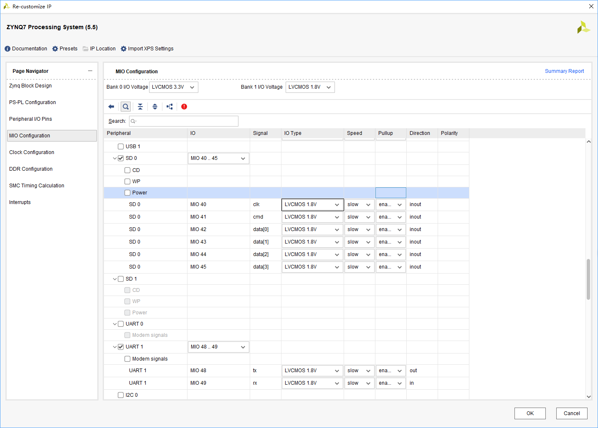
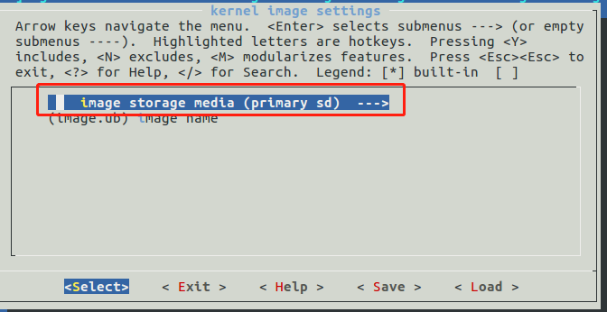

# Petalinux—无SD卡，EMMC启动

## 概述

​		EMMC启动和SD卡启动实质上是一样的。不同的是，EMMC是直接焊在开发板上的，不能拔下来进行复制格式化操作，所以需要在操作系统中对EMMC进行分区格式化操作。

​		简单描述一下启动的过程。本次借助一个hdf文件生成两套操作系统。第一套配置为BOOT.BIN由Flash启动，image.ub设置为SD卡启动，文件系统放在image.ub之中。第二套配置基本与第一套相同，只不过将文件系统单独分开，需解压放在EMMC的ext4分区之中。

​		开发的过程为先启动第一套操作系统对EMMC进行分区和格式化，将第二套操作系统的image.ub下载到EMMC的FAT32分区，将第二套操作系统的文件系统拷贝到EMMC的EXT4分区。之后重启板卡即可启动。

​		开发中还需要用到tftp下载与nfs，此项安装配置可参与附录链接。

## 底层搭建

​		由于是为了测试此种方法的可行性，故只在底层做了个最小系统。此步中需要注意的是，需要将网口配置正确，因为涉及tftp以及nfs。需要将SD配置正确，EMMC是选择了SD0还是SD1，勾选QSPI以及UART供串口打印信息。

根据需求勾选其余接口，正确配置时钟以及DDR即可。





底层搭建好之后，一步步生成bit文件即可。最后导出hdf文件以供Petalinux使用 。

## Petalinux系统搭建

​		本次需要搭建两套Petalinux的工程，第一套是启动一个Linux系统，需要完成的功能是将eMMC分区，格式化；将第二套系统的image.ub以及文件系统放到eMMC对应的分区之中。两套系统并无太大的差别，其中第一套系统将文件系统放进image.ub之中，不需要额外的文件系统；而第二套文件系统则需要将文件系统与image.ub分开，存放到eMMC中的ext4分区中。具体每一步差别在下文中展开。

### 创建工程

使用以下指令创建petalinux工程

```bash
#使用以下指令启动petalinux
#转到petalinux安装目录下，打开命令行窗口
source settings.sh
 petalinux-create --type project --template zynq --name emmc(工程名)
 cd emmc
```

### 导入配置信息

petalinux通过导入hdf文件导入工程的配置信息 ，hdf文件由vivado工程生成。

```bash
petalinux-config --get-hw-description=/home/yang/Desktop/emmc/emmc_test.sdk
```

在出现的图形化界面中修改以下选项 ，选择“Subsystem AUTO Hardware Settings”


选择“Advanced bootable images storge Settings”进入，配置BOOT.BIN以及image.ub存放位置


先配置BOOT.BIN，选择上图中的"boot image settings"


由于开发板没有SD卡，故将BOOT.BIN放在Flash中，由Flash引导启动。

退回至下图界面，选择“kernel image settings”配置内核





​	在本次工程中，两套系统的image.ub均采用从eMMC启动，第一次启动找不到image.ub。可通过tftp来加载本地服务器的内核 。

​	退回至下图，选择“Image Packaging Configuration“，此步可配置文件系统位置。


​	

选择“Root filesystem type”。第一套系统仅用来格式化分区，及将image.ub和文件系统放入eMMC，故采用的是“INITRAMFS”,此项相当于将文件系统放入image.ub之中。第二套系统需要将image.ub与文件系统分割开，此时就要选择“SD card”。两套系统的最大差别之处就在于此。


至此，此项配置完成。

### 配置内核

使用以下命令可配置内核。在图形化界面中，可进行配置功能。本次并未用到，无需任何修改。

```bash
petalinux-config -c kernel
```

### 配置文件系统

使用以下命令可对文件系统进行配置，本次工程中主要是配置相应的指令。根据需求提出一些建议勾选的指令。

```bash
petalinux-config -c rootfs
```

选择“Filesystem Packages”


```
admin->sudo->sudo
base->e2fsprogs->全部
base->tar->tar
base->util-linux->util-linux
				->util-linux-fsck.cramfs
				->util-linux-sfdisk
				->util-linux-mkfs.cramfs
				->util-linix-cfdisk
				->util-linux-umount
				->utillinux-mkfs
				->utillinux-mount
				->utillinux-fdisk
				->utillinux-fsck
console->vim->vim
console->neteork->rsync->全部
```

### 工程编译

使用以下命令可对工程进行编译

```bash
petalinux-build
```

### 合成BOOT.BIN

在build完成后使用以下指令合成BOOT.BIN

```bash
cd images/linux
petalinux-package --boot --format BIN --fsbl zynq_fsbl.elf  --fpga system.bit --u-boot --force
```

### 启动过程

第一次启动过程

```bash
U-Boot 2018.01 (Aug 19 2019 - 05:42:55 +0000) Xilinx Zynq ZC702

Board: Xilinx Zynq
Silicon: v3.1
DRAM:  ECC disabled 1 GiB
MMC:   mmc@e0100000: 0 (eMMC)
SF: Detected n25q256 with page size 256 Bytes, erase size 4 KiB, total 32 MiB
*** Warning - bad CRC, using default environment

In:    serial@e0001000
Out:   serial@e0001000
Err:   serial@e0001000
Board: Xilinx Zynq
Silicon: v3.1
Net:   ZYNQ GEM: e000b000, phyaddr ffffffff, interface rgmii-id
eth0: ethernet@e000b000
U-BOOT for emmc0

ethernet@e000b000 Waiting for PHY auto negotiation to complete.... done
BOOTP broadcast 1
DHCP client bound to address 192.168.1.115 (65 ms)
Hit any key to stop autoboot:  0
** Invalid partition 1 **
Device: mmc@e0100000
Manufacturer ID: fe
OEM: 14e
Name: MMC08
Tran Speed: 52000000
Rd Block Len: 512
MMC version 4.4.1
High Capacity: Yes
Capacity: 7.3 GiB
Bus Width: 4-bit
Erase Group Size: 512 KiB
HC WP Group Size: 8 MiB
User Capacity: 7.3 GiB
Boot Capacity: 2 MiB ENH
RPMB Capacity: 128 KiB ENH
** Invalid partition 1 **
Zynq>
```

此时输入以下指令可加载tftp

```bash
run netboot
```

如果出现以下情况则很有可能是因为服务器IP地址不匹配

```bash
Using ethernet@e000b000 device
TFTP from server 192.168.1.119; our IP address is 192.168.1.115
Filename 'image.ub'.
Load address: 0x10000000
Loading: *
ARP Retry count exceeded; starting again

```

可使用以下命令修改服务器ip，重新加载tftp服务器上的文件即可

```bash
 setenv serverip 192.168.1.118
```

在看到如下界面之后，等待加载服务器端内核完毕后即可正常启动系统

```
TFTP from server 192.168.1.118; our IP address is 192.168.1.115
Filename 'image.ub'.
Load address: 0x10000000
Loading: #################################################################
         #################################################################
         #################################################################
         #################################################################
         #################################################################
         #################################################################
         #################################################################
         #################################################################
         #################################################################
         #################################################################
         #################################################################

```

### 格式化eMMC

​	系统加载内核完毕之后，使用登录名和密码即可登录系统。用户名和密码均为“root”

​	使用fdisk工具对eMMC进行分区。

​	过程如下：

```bash
root@emmc0:~# fdisk /dev/mmcblk0

Welcome to fdisk (util-linux 2.30).
Changes will remain in memory only, until you decide to write them.
Be careful before using the write command.


Command (m for help): m

Help:

  DOS (MBR)
   a   toggle a bootable flag
   b   edit nested BSD disklabel
   c   toggle the dos compatibility flag

  Generic
   d   delete a partition
   F   list free unpartitioned space
   l   list known partition types
   n   add a new partition
   p   print the partition table
   t   change a partition type
   v   verify the partition table
   i   print information about a partition

  Misc
   m   print this menu
   u   change display/entry units
   x   extra functionality (experts only)

  Script
   I   load disk layout from sfdisk script file
   O   dump disk layout to sfdisk script file

  Save & Exit
   w   write table to disk and exit
   q   quit without saving changes

  Create a new label
   g   create a new empty GPT partition table
   G   create a new empty SGI (IRIX) partition table
   o   create a new empty DOS partition table
   s   create a new empty Sun partition table

Command (m for help): n
Partition type
   p   primary (0 primary, 0 extended, 4 free)
   e   extended (container for logical partitions)
Select (default p): p
Partition number (1-4, default 1):
First sector (2048-15335423, default 2048):
Last sector, +sectors or +size{K,M,G,T,P} (2048-15335423, default 15335423): +500M

Created a new partition 1 of type 'Linux' and of size 500 MiB.
Command (m for help): t

Selected partition 1
Hex code (type L to list all codes): L

 0  Empty           24  NEC DOS         81  Minix / old Lin bf  Solaris
 1  FAT12           27  Hidden NTFS Win 82  Linux swap / So c1  DRDOS/sec (FAT-
 2  XENIX root      39  Plan 9          83  Linux           c4  DRDOS/sec (FAT-
 3  XENIX usr       3c  PartitionMagic  84  OS/2 hidden or  c6  DRDOS/sec (FAT-
 4  FAT16 <32M      40  Venix 80286     85  Linux extended  c7  Syrinx
 5  Extended        41  PPC PReP Boot   86  NTFS volume set da  Non-FS data
 6  FAT16           42  SFS             87  NTFS volume set db  CP/M / CTOS / .
 7  HPFS/NTFS/exFAT 4d  QNX4.x          88  Linux plaintext de  Dell Utility
 8  AIX             4e  QNX4.x 2nd part 8e  Linux LVM       df  BootIt
 9  AIX bootable    4f  QNX4.x 3rd part 93  Amoeba          e1  DOS access
 a  OS/2 Boot Manag 50  OnTrack DM      94  Amoeba BBT      e3  DOS R/O
 b  W95 FAT32       51  OnTrack DM6 Aux 9f  BSD/OS          e4  SpeedStor
 c  W95 FAT32 (LBA) 52  CP/M            a0  IBM Thinkpad hi ea  Rufus alignment
 e  W95 FAT16 (LBA) 53  OnTrack DM6 Aux a5  FreeBSD         eb  BeOS fs
 f  W95 Ext'd (LBA) 54  OnTrackDM6      a6  OpenBSD         ee  GPT
10  OPUS            55  EZ-Drive        a7  NeXTSTEP        ef  EFI (FAT-12/16/
11  Hidden FAT12    56  Golden Bow      a8  Darwin UFS      f0  Linux/PA-RISC b
12  Compaq diagnost 5c  Priam Edisk     a9  NetBSD          f1  SpeedStor
14  Hidden FAT16 <3 61  SpeedStor       ab  Darwin boot     f4  SpeedStor
16  Hidden FAT16    63  GNU HURD or Sys af  HFS / HFS+      f2  DOS secondary
17  Hidden HPFS/NTF 64  Novell Netware  b7  BSDI fs         fb  VMware VMFS
18  AST SmartSleep  65  Novell Netware  b8  BSDI swap       fc  VMware VMKCORE
1b  Hidden W95 FAT3 70  DiskSecure Mult bb  Boot Wizard hid fd  Linux raid auto
1c  Hidden W95 FAT3 75  PC/IX           bc  Acronis FAT32 L fe  LANstep
1e  Hidden W95 FAT1 80  Old Minix       be  Solaris boot    ff  BBT
Hex code (type L to list all codes): c
Changed type of partition 'Linux' to 'W95 FAT32 (LBA)'.
Command (m for help): n
Partition type
   p   primary (1 primary, 0 extended, 3 free)
   e   extended (container for logical partitions)
Select (default p): p
Partition number (2-4, default 2):
First sector (1026048-15335423, default 1026048):
Last sector, +sectors or +size{K,M,G,T,P} (1026048-15335423, default 15335423):

Created a new partition 2 of type 'Linux' and of size 6.8 GiB.

Command (m for help): t
Partition number (1,2, default 2):
Hex code (type L to list all codes): 83

Changed type of partition 'Linux' to 'Linux'.

Command (m for help): w
The partition table has been altered.
Calling ioctl() to re-read partition table. mmcblk0: p1 p2

Syncing disks.


```

以上完成了对eMMC的分区，接下来进行格式化。

```bash
root@emmc0:~# mkfs.vfat /dev/mmcblk0p1
root@emmc0:~# mkfs.ext4 /dev/mmcblk0p2
mke2fs 1.43.5 (04-Aug-2017)
```

将第二套image.ub以及rootfs.tar.gz放到nfs指定的文件夹下。

在zynq的命令行界面使用以下指令挂载服务器文件夹到zynq

```
root@emmc0:~# mount -t nfs 192.168.1.118:/nfs  /mnt -o nolock
```

新建文件夹挂载eMMC的第一分区以及第二分区。

```
root@emmc0:~# mount /dev/mmcblk0p1 /emmc1
root@emmc0:~# cp /mnt/image.ub  /emmc1
root@emmc0:~# ls /emmc1
image.ub
root@emmc0:~# umount /dev/mmcblk0p1
root@emmc0:~# mount /dev/mmcblk0p2 /emmc2
EXT4-fs (mmcblk0p2): mounted filesystem with ordered data mode. Opts: (null)
root@emmc0:~# rsync -av /mnt/* /emmc2
sending incremental file list
image.ub
bin/
bin/ash -> /bin/busybox.nosuid
bin/base64 -> /usr/bin/base64.coreutils
......
var/local/
var/spool/
var/spool/mail/
var/volatile/

sent 1,514,814,673 bytes  received 253,366 bytes  5,092,665.68 bytes/sec
total size is 1,513,602,293  speedup is 1.00
root@emmc0:~# ls /emmc2
bin  boot  dev  etc  home  image.ub  lib  lost+found  media  mnt  proc  run  sbin  sys  tmp  usr  var
root@emmc0:~# umount /dev/mmcblk0p2

```

重启之后即可正常运行。

## 附录

### tftp服务器安装配置

<https://blog.csdn.net/xkwy100/article/details/80444287>

### nfs服务器配置

<https://www.cnblogs.com/wqs131/p/3800256.html?utm_source=tuicool&utm_medium=referral&tdsourcetag=s_pcqq_aiomsg>